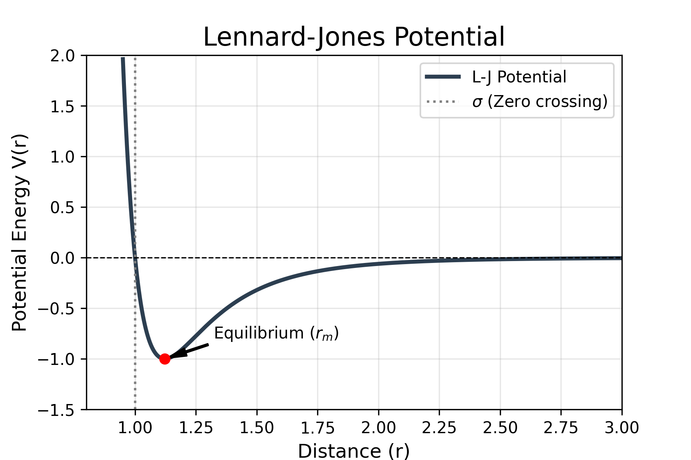

# The Lennard-Jones Potential

The **Lennard-Jones potential** (also referred to as the L-J potential or 6-12 potential) is a mathematically simple model that approximates the interaction between a pair of neutral atoms or molecules.

## 1. The Mathematical Model

The potential energy $V_{LJ}$ is expressed as a function of the distance $r$ between two particles:

$$V_{LJ}(r) = 4\epsilon \left[ \left( \frac{\sigma}{r} \right)^{12} - \left( \frac{\sigma}{r} \right)^{6} \right]$$

### Parameters:
* $r$: The distance between the centers of the two particles.
* $\epsilon$ (Epsilon): The depth of the potential well, representing how strongly the particles attract each other.
* $\sigma$ (Sigma): The distance at which the intermolecular potential is exactly zero (often referred to as the "collision diameter").

---

## 2. Physical Meaning of the Terms

The model consists of two distinct parts that compete to determine the stable distance between atoms:

1.  **The Repulsive Term** $\left( \frac{\sigma}{r} \right)^{12}$: 
    This term dominates at short ranges. It represents the Pauli exclusion principle that prevents electrons from occupying the same space, causing atoms to "bounce" off each other.
    
2.  **The Attractive Term** $\left( \frac{\sigma}{r} \right)^{6}$: 
    This term dominates at long ranges. It represents the **Van der Waals** forces (specifically London dispersion forces) caused by induced dipole-dipole interactions.

---

## 3. Key Characteristics

* **Equilibrium Distance:** The minimum energy occurs at a distance of $r_m = 2^{1/6}\sigma \approx 1.122\sigma$. At this point, the attractive and repulsive forces are perfectly balanced.
* **Applications:** It is widely used in molecular dynamics simulations because it is computationally efficient, despite being an approximation.
* **Limitation:** The $r^{-12}$ power for repulsion is chosen more for computational convenience (it is the square of $r^{-6}$) than for physical precision, as electronic repulsion is more accurately described by an exponential function.


```python
import numpy as np
import matplotlib.pyplot as plt

def lennard_jones(r, epsilon, sigma):
    """Calculate the Lennard-Jones potential."""
    return 4 * epsilon * ((sigma / r)**12 - (sigma / r)**6)

# Parameters for Argon (approximate)
epsilon = 1.0  # Depth of the well
sigma = 1.0    # Distance where potential is zero
r_min = 2**(1/6) * sigma  # Equilibrium distance

# Generate distances (avoiding r=0 to prevent division by zero)
r = np.linspace(0.95 * sigma, 3.0 * sigma, 500)
v = lennard_jones(r, epsilon, sigma)

# Create the plot
plt.figure(figsize=(6, 4))
plt.plot(r, v, color='#2c3e50', linewidth=2.5, label='L-J Potential')

# Add styling and markers
plt.axhline(0, color='black', linestyle='--', linewidth=0.8)
plt.axvline(sigma, color='gray', linestyle=':', label=r'$\sigma$ (Zero crossing)')
plt.scatter([r_min], [-epsilon], color='red', zorder=5)
plt.annotate(f'Equilibrium ($r_m$)', xy=(r_min, -epsilon), xytext=(r_min + 0.2, -epsilon + 0.2),
             arrowprops=dict(facecolor='black', shrink=0.05, width=1, headwidth=5))

# Formatting
plt.title('Lennard-Jones Potential', fontsize=16)
plt.xlabel('Distance (r)', fontsize=12)
plt.ylabel('Potential Energy V(r)', fontsize=12)
plt.ylim(-1.5 * epsilon, 2 * epsilon)
plt.xlim(0.8 * sigma, 3 * sigma)
plt.grid(alpha=0.3)
plt.legend()

# Save the plot for your website (put the PNG in this note's folder: content/notes/2026-02-lennard-jones/)
plt.savefig('lennard_jones_plot.png', dpi=300)
plt.show()
```



---

> *Note: This potential is most accurate for noble gases (like Argon or Neon) but serves as a fundamental building block for modeling more complex molecular systems.*
