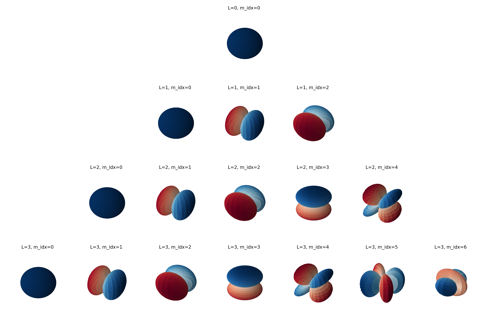

# Spherical Harmonics and e3nn

**Spherical Harmonics** ($Y_{\ell}^m$) are a set of orthogonal functions defined on the surface of a sphere. They are the angular portion of a set of solutions to Laplace's equation and serve as the Fourier basis for functions defined on a sphere.

## 1. Mathematical Overview

In spherical coordinates $(\theta, \phi)$, the real spherical harmonics are defined as:
$$Y_{\ell}^m(\theta, \phi) = N_{\ell}^m P_{\ell}^m(\cos \theta) \text{trig}(m\phi)$$

Where:
- $\ell \ge 0$ is the **degree** (angular momentum).
- $-\ell \le m \le \ell$ is the **order**.
- $P_{\ell}^m$ are the associated Legendre polynomials.
- $N_{\ell}^m$ is a normalization constant.

In modern geometric machine learning, we often represent these in **Cartesian coordinates** $(x, y, z)$, where they become homogeneous polynomials of degree $\ell$.

---

## 2. Using the `e3nn` Library

The [e3nn](https://github.com/e3nn/e3nn) library is designed for **Euclidean Neural Networks**. It uses spherical harmonics as the primary way to lift geometric data (like atomic positions) into a representation that is equivariant to rotations ($SO(3)$) and inversion ($O(3)$).

### Key Concepts in e3nn:
* **Irreps (Irreducible Representations):** e3nn tracks how data transforms. A spherical harmonic of degree $\ell$ belongs to the irrep $\ell$.
* **Parity:** In e3nn, spherical harmonics have a definite parity $p = (-1)^\ell$.
* **Coordinate Convention:** e3nn typically expects input vectors in $(x, y, z)$ but internally uses a $y, z, x$ convention for alignment with standard real spherical harmonics.

---

## 3. Python Implementation

To use this code, you will need to install the library:
`pip install e3nn torch`

### Code Example: Generating and Visualizing
The following script calculates the spherical harmonic coefficients for a given set of vectors.

```python
import torch
from e3nn import o3
import numpy as np
import matplotlib.pyplot as plt
from matplotlib import cm

def plot_all_harmonics(l_max):
    fig = plt.figure(figsize=(12, 8))
    
    # Grid coordinates for sampling the sphere
    phi, theta = np.mgrid[0:2*np.pi:70j, 0:np.pi:70j]
    x = np.sin(theta) * np.cos(phi)
    y = np.sin(theta) * np.sin(phi)
    z = np.cos(theta)
    vectors = torch.tensor(np.stack([x.flatten(), y.flatten(), z.flatten()], axis=1), dtype=torch.float32)

    plot_idx = 1
    for l in range(l_max + 1):
        # Get irreps and compute SH for this specific L
        irreps = o3.Irreps.spherical_harmonics(l)
        sh_values = o3.spherical_harmonics(irreps, vectors, normalize=True)
        
        # There are 2L + 1 components for each L
        num_m = 2 * l + 1
        
        for m_idx in range(num_m):
            # Create subplot: rows = l_max+1, cols = 2*l_max+1
            # We center the plots by offsetting the start index
            ax_idx = l * (2 * l_max + 1) + (l_max - l) + m_idx + 1
            ax = fig.add_subplot(l_max + 1, 2 * l_max + 1, ax_idx, projection='3d')
            
            # Extract the specific m component
            r_vals = sh_values[:, m_idx].reshape(70, 70).numpy()
            
            # Radial distance is absolute value, color is the sign
            R = np.abs(r_vals)
            X_p, Y_p, Z_p = R * x, R * y, R * z
            
            # Normalize colors so 0 is white/middle
            v_max = np.max(np.abs(r_vals))
            norm = plt.Normalize(-v_max, v_max)
            colors = cm.RdBu(norm(r_vals))

            ax.plot_surface(X_p, Y_p, Z_p, facecolors=colors, antialiased=True, shade=True)
            
            ax.set_title(f"L={l}, m_idx={m_idx}", fontsize=8)
            ax.axis('off')
            
    plt.tight_layout()
    plt.savefig('spherical_harmonics_l3.png', dpi=300, transparent=True)
    plt.show()

plot_all_harmonics(l_max=3)

```




